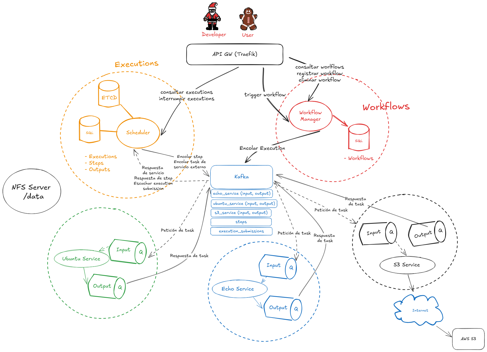

# TaskComposer

## Description
An extensible, async-based workflow runner. 

Its a project created for 73.40-Microservices Architecture @ITBA. It is used to learn the basics of microservice architecture, async communication, Docker, Kubernetes, distributed processing and testing, CI/CD, and logging/tracing.

Technologies used:
- [Docker+Docker Compose](https://www.docker.com/)
- [Go](https://go.dev/)
- [Java](https://www.java.com/en/)
- [Kubernetes](https://kubernetes.io/)
- [Terraform](https://www.terraform.io/)
- [Helm](https://helm.sh/)
- Python
- [Traefik](https://traefik.io/traefik/)
- [Signoz](https://signoz.io/)
- [Apache Kafka](https://kafka.apache.org/)
- [etcd](https://etcd.io/)


## Architecture


## Services
- [Workflow Manager](workflow-manager/README.md)
- [Scheduler](scheduler/README.md)
- [S3 Service](s3-service/README.md)
- [Ubuntu Service](ubuntu-service/README.md)
- [Echo Service](echo-service/README.md)

## Requirements
Generally, the project can be ran just using [Docker and Docker Compose](https://docs.docker.com/engine/install/). 

Using ./local-all.sh launches all core services and task runners, however you should specify different host ports for the [scheduler](scheduler/README.md) and [workflow-manager](workflow-manager/README.md). Of course, this is not that practical for development, so generally there are two different environment variables, .env.docker for running in docker compose and .env.local for running locally without Docker. 

Keep in mind that if you want to run it locally the system has to have the programming language and dependencies installed.

For the Signoz service, we haven't have much luck running it locally due to the fact that it requires a docker compose that you have to clone manually. Just ignore the warnings of not tracking correctly.

## Deployment
The service runs on a Kubernetes cluster, which we didn't have at the time, so if you are running this service on AWS, the [terraform](terraform/README.md) lets you spin up a simple cluster of 1 main node and 3 worker nodes. It also spins up a NFS Server, which is used for file sharing between services. 

For the final deployment, you need to have each image pushed onto a Docker Image Registry, and then run the Helmfile so it can create the changeset and push the final changes to the Kubernetes cluster.

There are two methods of deployment, manual and continuous deployment.
The [deploy](deploy/README.md) module has both templates. The continuous deployment has to have the credentials to a valid Docker Registry (we used a public one so we don't have to fiddle with security, this is NOT recommended) and the .kube/config file from the deployed cluster.

- It must be filled with the .kube/config ($KUBE_CONFIG_FILE) of the k8s cluster and the IP of the NFS server ($NFS_SERVER) in the CI/CD Variables
- Run a pipeline from the GitLab page in /Build/Pipelines/New Pipeline
- Choose the branch in which you want to deploy and run the pipeline
- Set the variable "CI_MANUAL_DEPLOYMENT" with value "true"
- Wait for the entire pipeline to run
- Click "Play" in the "deploy" job to execute the deploy script

Manual deployment consists on using helmfile apply locally.

Fill the relevant environment variables in .env.template
```
helmfile init && helmfile apply
```

```
El deploy de la aplicación se hace manualmente debido a que AWS educate no nos otorga un ambiente de Kubernetes estable. Si tuviesemos un ambiente que no se muera a la hora el deploy se haría automáticamente.
```

## Signoz for Local
```
git clone -b main https://github.com/SigNoz/signoz.git && cd signoz/deploy/

docker compose up

Use http://<your-machine-ip>:4318 for the java endpoint and
<your-machine-ip>:4318 for the go endpoint for OpenTelemetry
```

## Authors
- [Franco Rupnik](https://github.com/RupnikF)
- [Matías Manzur](https://github.com/MatyManzur)
- [Federico Shih](https://github.com/Federico-Shih)